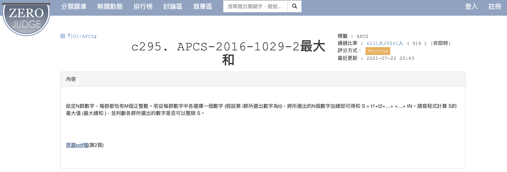

# APCS_最大和
題目來源：https://zerojudge.tw/ShowProblem?problemid=c295


## 題目內容

給定一個整數數列，找出其中一段連續子數列，使得這段子數列的和最大，並輸出這個最大和。

## 規範

1. 數列中的數字可以是正數、負數或零。
2. 數列的長度不超過 100000。

## 解題方式

在 [`answer.py`](answer.py) 中，我們使用了動態規劃的方法來解決這個問題。具體步驟如下：

### 主要步驟

1. **讀取輸入資料**：
    - 使用 `for` 迴圈讀取每行數據，並將其轉換為整數列表 `inputarray`。
    - 將每行數據中的最大值添加到 `maxnum` 列表中。

2. **計算最大和**：
    - 使用 `sum()` 函數計算 `maxnum` 列表的總和，並存儲在 `MaxSum` 變數中。
    - 輸出 `MaxSum` 的值。

3. **找出可被最大和整除的數字**：
    - 使用 `for` 迴圈遍歷 `maxnum` 列表中的每個元素。
    - 如果 `MaxSum` 能被該元素整除，則將該元素添加到 `divisible` 列表中。

4. **輸出結果**：
    - 如果 `divisible` 列表為空，則輸出 `-1`。
    - 否則，將 `divisible` 列表中的元素以空格分隔輸出。


### 範例

假設輸入數列為：

```python
3 2
1 5
6 4
1 1
```

則輸出結果為：
```python
12  # 5+6+1
6 1 # 5、6、1 三數中可以跟12整除的只有6和1
```