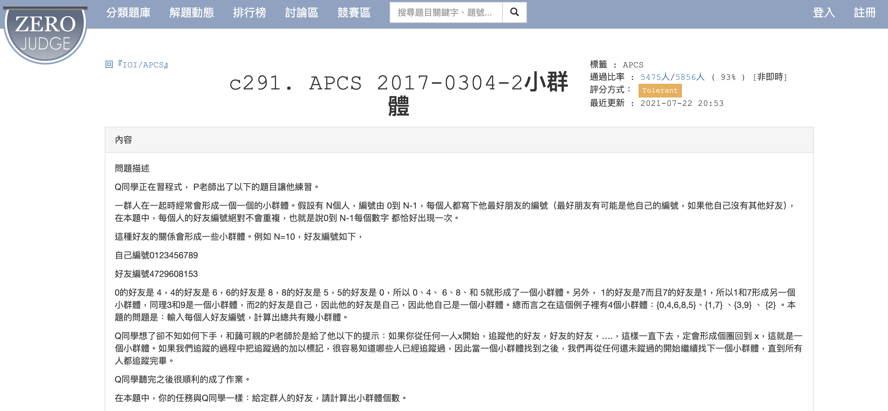

# APCS_小群體
題目來源：https://zerojudge.tw/ShowProblem?problemid=c291

## 題目內容

給定一個包含 `n` 個人的團體，每個人都有一個好朋友。找出這個團體中有多少個小群體，每個小群體中的人都是互相認識的。

## 規範

1. 每個人的好友編號絕對不會重複。
2. 每個人都有好朋友。（最好朋友有可能是他自己）

## 解題方式

在 [`answer.py`](answer.py) 中，我們使用了標記和遍歷的方法來解決這個問題。具體步驟如下：

### 主要步驟

1. **讀取輸入資料**：
    - 使用 `input()` 函數讀取團體中的人數 `n`。
    - 使用 `input()` 函數讀取好友列表，並將其轉換為整數列表 `friends`。

2. **初始化變數**：
    - 初始化標記列表 `mark`，用於標記每個人是否已經被找過。
    - 初始化群體計數器 `group` 為 `0`。

3. **遍歷團體**：
    - 使用 `for` 迴圈從第 `0` 個人開始遍歷團體中的每個人。
    - 如果當前人已經被標記過，則跳過。
    - 否則，標記當前人並開始找其好朋友，直到回到起點。
    - 每找到一個新的小群體，將群體計數器 `group` 加 `1`。

4. **輸出結果**：
    - 最終輸出群體計數器 `group`，即為團體中小群體的數量。

### 範例

假設輸入數列為：

```python
10
4 7 2 9 6 0 8 1 5 3
```

則輸出結果為：
```python
4
```
