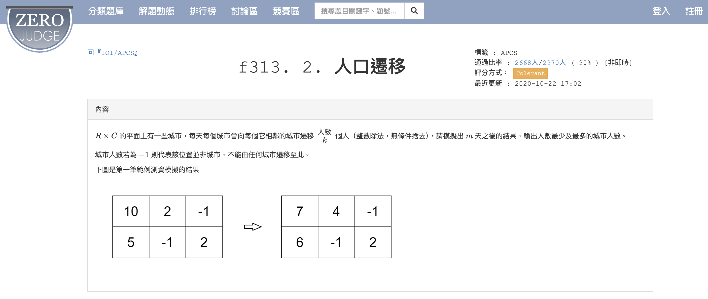

# APCS_人口遷移
題目來源：https://zerojudge.tw/ShowProblem?problemid=f313



## 題目內容

給定一個城市的初始人口分佈，模擬多輪人口遷移後的最終人口分佈。每輪遷移中，每個格子的人口會按照一定比例遷移到其四周的格子。

## 規範

1. 城市的行數 `R` 和列數 `C` 不超過50。
2. 如果是 -1 表示這個座標沒有城市，否則表示這個座標的城市人數數量，保證是非負整數。

## 解題方式

在 [`answer.py`](answer.py) 中，我們使用了二維陣列來儲存城市的人口分佈，並模擬多輪遷移。具體步驟如下：

### 主要步驟

1. **讀取輸入資料**：
    - 使用 `input()` 函數讀取城市的行數 `R`、列數 `C`、分配比例 `k` 和遷移輪數 `m`。
    - 使用 `for` 迴圈讀取每行的初始人口數，並將其存儲在二維陣列 `city` 中。

2. **初始化變數**：
    - 定義四個方向的座標偏移量 `around`，分別表示左、上、右、下四個方向。
    - 建立與 `city` 相同大小的陣列 `citytemp`，用於暫存每輪遷移後的結果。

3. **模擬遷移過程**：
    - 使用 `for` 迴圈進行 `m` 輪遷移。
    - 對於每個格子，根據其四周的格子進行人口遷移。
    - 如果格子是禁區（人口數為 -1），則保持為 -1。

4. **更新人口分佈**：
    - 每輪遷移結束後，將 `citytemp` 的值更新到 `city` 中，準備進行下一輪遷移。

5. **輸出結果**：
    - 最終輸出每個格子的人口數。

### 範例

假設輸入數列為：

```python
2 3 4 1
10 2 -1 
5 -1 2
```

則輸出結果為：
```python
2
7
```
