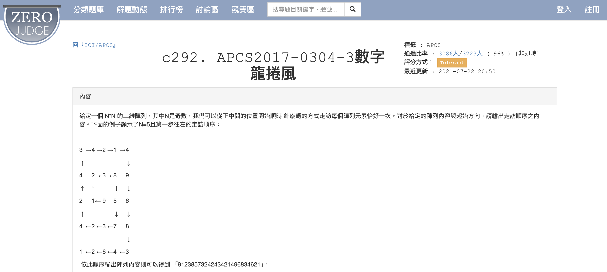

# APCS_數字龍捲風
題目來源：https://zerojudge.tw/ShowProblem?problemid=c292


## 題目內容

給定一個 `n x n` 的數字矩陣，從矩陣的中心開始，按照指定的方向進行螺旋移動，輸出經過的數字。

## 規範

1. 矩陣的大小 `n` 為奇數，且不小於 3。
2. 移動方向 `direction` 為 0、1、2 或 3，分別表示0代表左 、1代表上 、2代表右 、3代表下。

## 解題方式

在 [`answer.py`](answer.py) 中，我們使用了二維陣列來儲存數字矩陣，並模擬螺旋移動。具體步驟如下：

### 主要步驟

1. **讀取輸入資料**：
    - 使用 `input()` 函數讀取矩陣的大小 `n` 和移動方向 `direction`。
    - 使用 `for` 迴圈讀取每行的數字，並將其存儲在二維陣列 `array` 中。

2. **初始化變數**：
    - 設定起始位置 `positionx` 和 `positiony` 為矩陣的中心。
    - 根據移動方向 `direction` 設定步伐 `diff` 的初始值。

3. **模擬螺旋移動**：
    - 使用 `for` 迴圈進行螺旋移動，`i` 表示步數層數。
    - 根據移動方向，分別進行水平和垂直方向的移動。
    - 每次移動後，輸出當前位置的數字。
    - 當超出矩陣範圍時，跳出循環。

4. **輸出結果**：
    - 最終輸出經過的數字，無換行。

### 範例

假設輸入數列為：

```python
5
0
3 4 2 1 4
4 2 3 8 9
2 1 9 5 6
4 2 3 7 8
1 2 6 4 3
```

則輸出結果為：
```python
9123857324243421496834621
```
