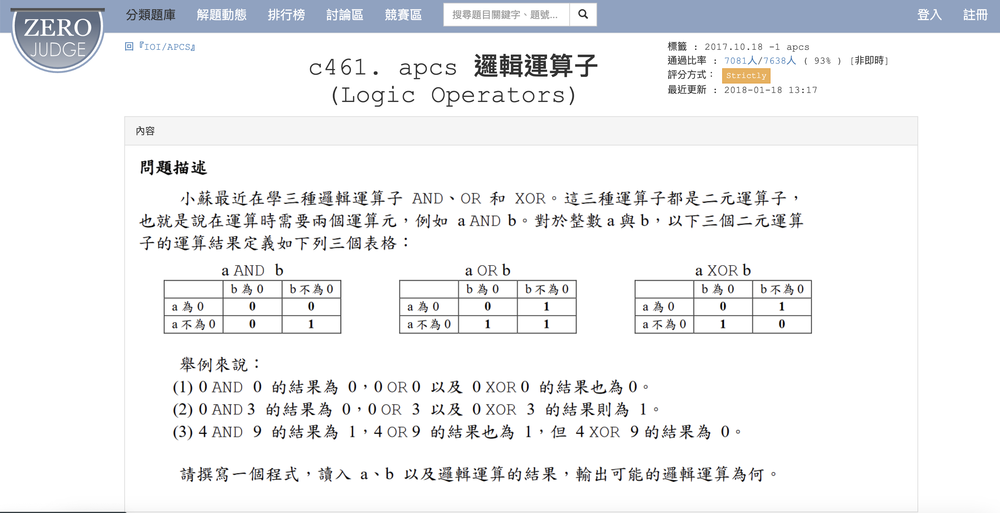

# APCS_邏輯運算子
題目來源：https://zerojudge.tw/ShowProblem?problemid=c461


## 題目內容

給定三個整數 `a`、`b` 和 `result`，判斷 `a` 和 `b` 之間的邏輯運算結果是否等於 `result`。邏輯運算包括 AND、OR 和 XOR。如果符合其中一種運算，輸出對應的運算名稱；如果都不符合，輸出 "IMPOSSIBLE"。

## 規範

1. `a` 和 `b` 為 0 或 1。
2. `result` 代表邏輯運算的結果，只會是 0 或 1。

## 解題方式

在 [`answer.py`](answer.py) 中，我們使用了邏輯運算來判斷 `a` 和 `b` 的運算結果是否等於 `result`。具體步驟如下：

### 主要步驟

1. **讀取輸入資料**：
    - 使用 `input()` 函數讀取三個整數 `a`、`b` 和 `result`，並將其存儲在列表 `a_b_result` 中。

2. **初始化變數**：
    - 初始化一個空的結果列表 `result_list`，用於存儲邏輯運算結果。

3. **判斷邏輯運算結果**：
    - 使用 `if-else` 判斷 AND (且) 條件，並將結果添加到 `result_list` 中。
    - 使用 `if-else` 判斷 OR (或) 條件，並將結果添加到 `result_list` 中。
    - 使用 `if-else` 判斷 XOR (異或) 條件，並將結果添加到 `result_list` 中。

4. **輸出結果**：
    - 根據 `result_list` 中的結果，判斷是否與輸入的 `result` 相等。
    - 如果 AND 結果等於 `result`，輸出 "AND"。
    - 如果 OR 結果等於 `result`，輸出 "OR"。
    - 如果 XOR 結果等於 `result`，輸出 "XOR"。
    - 如果所有邏輯運算的結果都不等於 `result`，輸出 "IMPOSSIBLE"。

### 範例

假設輸入數列為：

```python
0 0 0 
```

則輸出結果為：
```python
AND 
OR 
XOR
```
