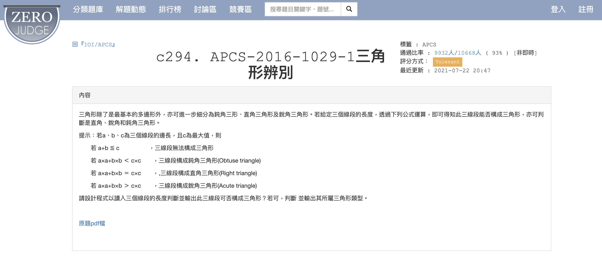

# APCS_三角形辨別
題目來源：https://zerojudge.tw/ShowProblem?problemid=c294


## 題目內容

給定三個正整數，判斷這三個數字是否可以構成三角形。如果可以，進一步判斷這個三角形是銳角三角形、直角三角形還是鈍角三角形。

## 規範

1. 三個數字為正整數。
2. 輸入的三個數字可以任意排列。

## 解題方式

在 [`answer.py`](answer.py) 中，我們使用了數學方法來判斷三角形的類型。具體步驟如下：

### 主要步驟

1. **讀取輸入資料**：
    - 使用 `input()` 函數讀取三個正整數，並將其轉換為整數列表。
    - 使用 `sorted()` 函數將三個數字由小到大排序，分別賦值給 `a`、`b` 和 `c`。

2. **判斷是否可以構成三角形**：
    - 如果最短兩邊的和小於或等於最大邊，則無法形成三角形，輸出 "No"。

3. **判斷三角形的類型**：
    - 如果最短兩邊的平方和小於最大邊的平方，則為鈍角三角形，輸出 "Obtuse"。
    - 如果最短兩邊的平方和等於最大邊的平方，則為直角三角形，輸出 "Right"。
    - 如果最短兩邊的平方和大於最大邊的平方，則為銳角三角形，輸出 "Acute"。

### 範例

假設輸入數列為：

```python
101 100 99
```

則輸出結果為：
```python
99 100 101
Acute
```
