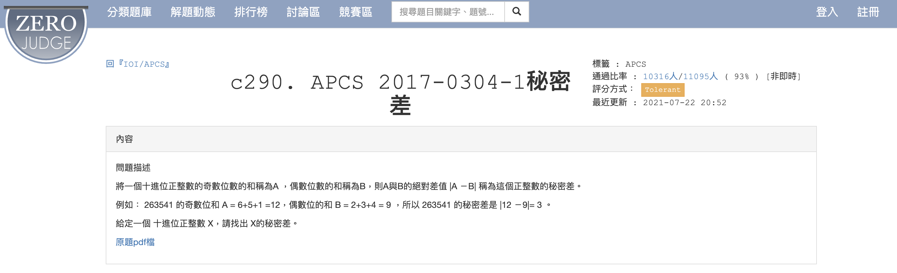

# APCS_秘密差
題目來源：https://zerojudge.tw/ShowProblem?problemid=c290


## 題目內容

給定一個十進位正整數，計算其奇數位數字之和與偶數位數字之和的差，並輸出這個差的絕對值。

## 規範

1. 輸入為一個十進位正整數。
2. 輸出的差為奇數位數字之和與偶數位數字之和的絕對值。

## 解題方式

在 [`answer.py`](answer.py) 中，我們使用了迴圈和條件判斷來計算奇數位和偶數位數字之和的差。具體步驟如下：

### 主要步驟

1. **讀取輸入資料**：
    - 使用 `input()` 函數讀取一個十進位正整數 `x`。

2. **初始化變數**：
    - 初始化 `odd` 為 `0`，用於存儲奇數位數字之和。
    - 初始化 `even` 為 `0`，用於存儲偶數位數字之和。
    - 初始化計數器 `i` 為 `1`，用於判斷當前位數是奇數位還是偶數位。

3. **計算奇數位和偶數位數字之和**：
    - 使用 `while` 迴圈遍歷數字 `x` 的每一位。
    - 使用 `x % 10` 取出數字的最後一位 `d`。
    - 如果 `i` 是偶數，將 `d` 加到 `even`；否則，將 `d` 加到 `odd`。
    - 使用 `x //= 10` 去掉數字的最後一位。
    - 將計數器 `i` 加 `1`。

4. **計算差的絕對值**：
    - 計算 `odd` 和 `even` 的差 `diff`。
    - 如果 `diff` 小於 `0`，取其絕對值。

5. **輸出結果**：
    - 最終輸出 `diff` 的值。

### 範例

假設輸入數列為：

```python
263541
```

則輸出結果為：
```python
3  # |(2+3+4)-(6+5+1)|
```
